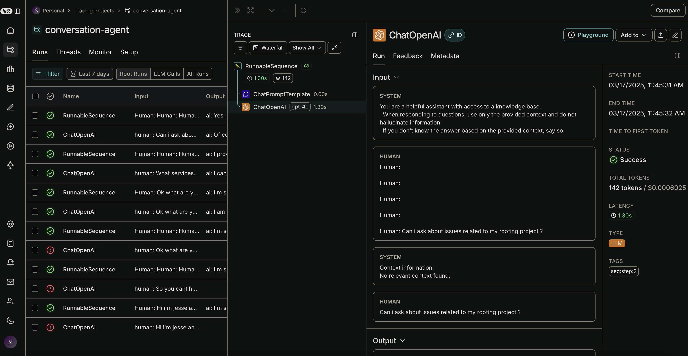

# LLM Agent Application Template

A production-grade LLM application template built with LangGraph, LangChain.js, and TypeScript. This application provides conversational AI with action extraction capabilities and RAG for context enhancement.



## Features

- 🧠 **Advanced Conversational AI**: Utilizes OpenAI's latest models with effective prompt engineering
- 📚 **Retrieval Augmented Generation (RAG)**: Enriches responses with relevant knowledge from Pinecone vector database
- 🔧 **Action Extraction**: Identifies user intents and extracts structured actions (booking, notes, reminders)
- 📋 **State Management**: Maintains conversation context with DynamoDB persistence
- 🔄 **Async Action Processing**: Background workers for action execution with proper error handling
- 🔌 **REST API**: Clean, well-documented endpoints for conversation and action management
- 🛡️ **Production-Ready**: Includes logging, error handling, validation, and security best practices

## Architecture

The application follows a modular architecture with clear separation of concerns:

- **API Layer**: Express.js based REST API for client interactions
- **Graph Layer**: LangGraph workflows for conversational logic
- **Storage Layer**: DynamoDB for conversation and action persistence
- **Vector Layer**: Pinecone for semantic search and retrieval
- **Worker Layer**: Background processors for asynchronous action execution

## Getting Started

### Prerequisites

- Node.js 18+ and npm
- AWS account with DynamoDB access
- Pinecone account
- OpenAI API key

### Installation

1. Clone the repository
   ```bash
   git clone https://github.com/yourusername/llm-agent-app.git
   cd llm-agent-app
   ```

2. Install dependencies
   ```bash
   npm install
   ```

3. Configure environment variables
   ```bash
   cp .env.example .env
   # Edit .env with your API keys and configuration
   ```

4. Create required DynamoDB tables
   ```bash
   # conversation-states table
   aws dynamodb create-table \
     --table-name conversation-states \
     --attribute-definitions AttributeName=id,AttributeType=S \
     --key-schema AttributeName=id,KeyType=HASH \
     --billing-mode PAY_PER_REQUEST

   # action-queue table
   aws dynamodb create-table \
     --table-name action-queue \
     --attribute-definitions AttributeName=id,AttributeType=S AttributeName=conversationId,AttributeType=S \
     --key-schema AttributeName=id,KeyType=HASH \
     --global-secondary-indexes 'IndexName=conversationId-index,KeySchema=[{AttributeName=conversationId,KeyType=HASH}],Projection={ProjectionType=ALL}' \
     --billing-mode PAY_PER_REQUEST
   ```

5. Set up a Pinecone index
   ```bash
   # Create a new index in Pinecone UI or API
   # Match the index name in your .env file
   ```

### Development

```bash
# Start the application in development mode
npm run dev

# Run linting
npm run lint

# Run tests
npm run test
```

### Production Deployment

```bash
# Build the application
npm run build

# Start the application
npm start
```

## API Endpoints

### Conversation Endpoints

- `POST /api/conversation/chat`: Send a message and get a response
- `GET /api/conversation/:conversationId`: Get conversation history
- `DELETE /api/conversation/:conversationId`: Delete a conversation

### Action Endpoints

- `GET /api/actions/conversation/:conversationId`: Get all actions for a conversation
- `GET /api/actions/:actionId`: Get a specific action
- `PUT /api/actions/:actionId`: Update an action
- `POST /api/actions/:actionId/complete`: Mark an action as completed
- `POST /api/actions/:actionId/fail`: Mark an action as failed

## Project Structure

```
src/
├── config/            # Configuration files
├── models/            # LLM and embedding models
├── vectorstore/       # Pinecone integration
├── chains/            # LangChain chains
├── graphs/            # LangGraph workflows and nodes
├── tools/             # Action tools (booking, notes)
├── conversation/      # Conversation management
├── api/               # API endpoints
├── storage/           # DynamoDB storage
├── workers/           # Background workers
├── utils/             # Utility functions
├── types/             # TypeScript type definitions
└── index.ts           # Application entry point
-----------------------------------------------------------------------------

src/
├── config/
│   ├── env.ts                 # Environment variable configuration
│   └── constants.ts           # Application constants
├── models/
│   ├── llm.ts                 # LLM model configurations
│   └── embeddings.ts          # Embedding models
├── vectorstore/
│   ├── pinecone-client.ts     # Pinecone client setup
│   └── vector-store.ts        # Vector store operations
├── chains/
│   └── rag-chain.ts           # RAG implementation
├── conversation/
│   ├── memory.ts              # Conversation memory utilities
│   └── history.ts             # History management
├── graphs/
│   ├── state.ts               # LangGraph state definitions
│   ├── conversation-graph.ts  # Main conversation graph
│   └── nodes/
│       ├── retrieval.ts       # Context retrieval node
│       ├── extract-actions.ts # Action extraction node
│       ├── execute-actions.ts # Action execution node
│       └── generate.ts        # Response generation node
├── tools/
│   ├── function-definitions.ts # Function definitions for action extraction
│   ├── booking-tool.ts         # Appointment booking implementation
│   └── note-tool.ts            # Note-taking implementation
├── storage/
│   ├── dynamo-client.ts        # DynamoDB client setup
│   ├── conversation-store.ts   # Conversation state persistence
│   └── action-store.ts         # Action queue implementation
├── api/
│   ├── server.ts               # Express server setup
│   ├── routes.ts               # API route definitions
│   ├── conversation.ts         # Conversation endpoints
│   └── actions.ts              # Action management endpoints
├── types/
│   ├── conversation.ts         # Conversation type definitions
│   └── actions.ts              # Action type definitions
├── utils/
│   ├── error-handler.ts        # Error handling utilities
│   ├── logger.ts               # Logging utilities
│   └── validators.ts           # Input validation
└── index.ts                    # Application entry point
```

## Extending the Application

### Adding New Action Types

1. Define the action type in `src/config/constants.ts`
2. Create a function definition in `src/tools/function-definitions.ts`
3. Add a handler in `src/workers/action-processor.ts`
4. Add validation schema in `src/utils/validators.ts`

### Adding New LangGraph Nodes

1. Create a new node file in `src/graphs/nodes/`
2. Implement the node function with appropriate input/output typing
3. Add the node to your graph in `src/graphs/conversation-graph.ts`

## License

[MIT](LICENSE)